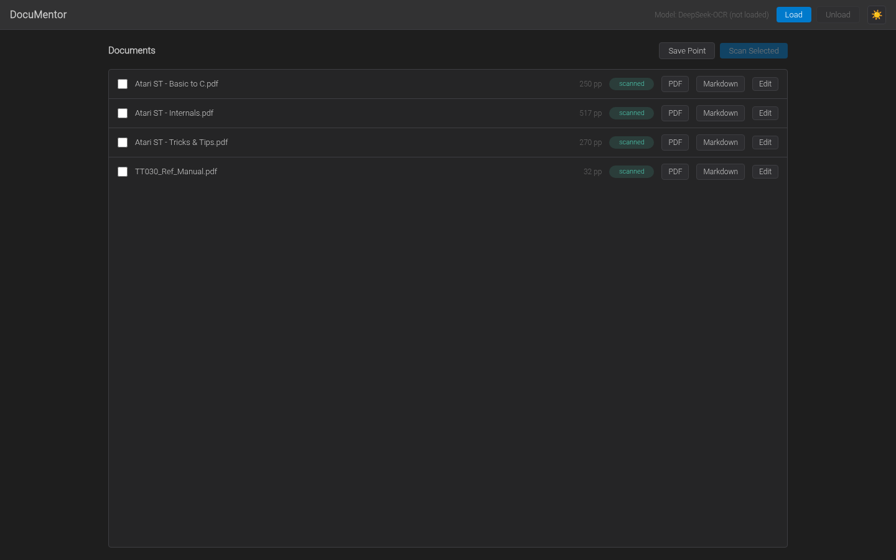
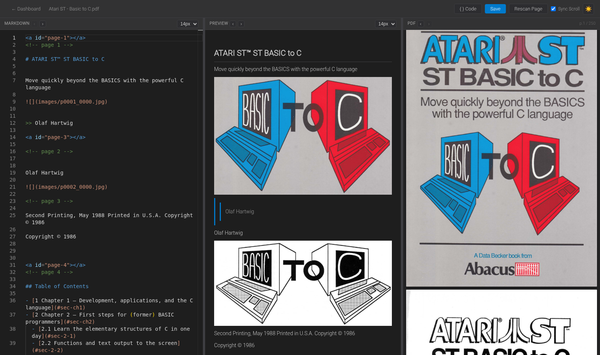

# DocuMentor

A self-hosted web app that converts PDF files to Markdown using [DeepSeek-OCR](https://huggingface.co/deepseek-ai/DeepSeek-OCR), a vision-language model, then gives you a full in-browser editor to clean up the result against the original page images. Pages are rendered to PNG at 300 DPI via PyMuPDF, passed through the model one page at a time, and written to a single `.md` file per PDF alongside its extracted figures.

## Screenshots

**Dashboard** — every PDF in `input/`, its scan status, and one-click actions:



**Editor** — three synced panes (Markdown source, live preview, original PDF) for proofreading OCR output page by page:



## Requirements

- Linux (tested on MX Linux)
- Python 3.12
- NVIDIA GPU with CUDA 12.1 support (model runs on GPU via PyTorch)
- ~10 GB free VRAM (RTX 3090 or similar recommended)
- [`astyle`](https://astyle.sourceforge.net/) for the editor's C/C++/C# code-block formatting (optional): `sudo apt install astyle`
- [`glow`](https://github.com/charmbracelet/glow) for the legacy terminal preview (optional, only used by `documenter.py`): `sudo apt install glow`

## Installation

Clone the repo:

```bash
git clone https://github.com/davidblackuk/documentor.git
cd documentor
```

Create and activate the virtual environment (the venv lives at the repo root):

```bash
python3.12 -m venv .
source bin/activate
```

> If Python 3.12 isn't your system default, use the full interpreter path, e.g. `/usr/local/bin/python3.12 -m venv .`

Install dependencies:

```bash
pip install torch torchvision --index-url https://download.pytorch.org/whl/cu121
pip install transformers accelerate pymupdf rich pillow pyfiglet fastapi uvicorn
```

Download the model weights (not included in this repo):

```bash
pip install huggingface_hub
huggingface-cli download deepseek-ai/DeepSeek-OCR --local-dir ~/Documents/AI/ComfyUI/models/deepseek-ocr/deepseek-ai_DeepSeek-OCR
```

That path matches the hardcoded `DEEPSEEK_PATH` in `ocr_core.py`. If you store the weights elsewhere, update that constant.

## Running it

```bash
./start.sh
```

This activates the venv and starts the web server at **http://127.0.0.1:8000** — open that in a browser. `Ctrl+C` stops it.

Drop PDFs into the `input/` directory, refresh the dashboard, and they'll show up ready to scan.

## Using the app

### Dashboard

- Lists every PDF in `input/` with page count and status (`pending` / `partial` / `scanned`).
- **Load / Unload** — the model is a GPU-resident singleton; load it once before scanning, unload it to free VRAM.
- Select one or more PDFs and **Scan Selected** to OCR them page by page with live progress.
- **PDF** / **Markdown** buttons open a quick read-only view of the source PDF or the rendered Markdown.
- **Edit** opens the full three-pane editor for a document.
- **Save Point** commits any pending changes in `output/` and pushes them to its remote (see [Backing up your edits](#backing-up-your-edits)).

### Editor

- Three resizable, scroll-synced panes: the raw Markdown (Monaco editor), a live rendered **Preview**, and the original **PDF** page images — so you can proofread OCR output against the source at a glance.
- **Rescan Page** re-runs OCR on just the current page and merges the result back into the document, without touching the rest of the file.
- **{ } Code** wraps a selection in a formatted fenced code block — supports C, C#, BASIC, Z80 assembly, and MC68000 assembly (useful for the retro-computing manuals this tool was originally built for).
- Font size controls per pane, pane reordering, and a light/dark theme toggle (persisted across sessions).

### Backing up your edits

Because a rescan overwrites whatever was previously in a page (or the whole document), `output/` is set up as its **own independent git repository**, separate from the app's repo:

- Every save auto-commits the current state of `output/` *before* overwriting anything, so a bad rescan is always one `git checkout` away from being undone.
- The dashboard's **Save Point** button additionally pushes that history to a remote, so your edits survive a lost or wiped machine too.

To set this up yourself: `cd output && git init`, then add a remote and push as usual.

## Directory layout

```
input/      ← drop PDFs here
output/     ← one subdirectory per PDF: <stem>/<stem>.md + images/ (its own git repo)
preview/    ← temporary output from Test Scan (page-range previews, legacy TUI only)
```

## Legacy terminal UI

The original terminal UI (`documenter.py`) still works for headless or scripted use:

```bash
source bin/activate
python documenter.py
```

There's also a bare headless batch script with no resume logic, `run_ocr.py`, kept for reference:

```bash
python run_ocr.py [input_dir] [output_dir]
```

Both are superseded by the web app for everyday use.

## Known issues

- Code pages (dense text, listings) can trigger a repetition loop in the model, producing very long outputs. No mitigation is currently in place.
